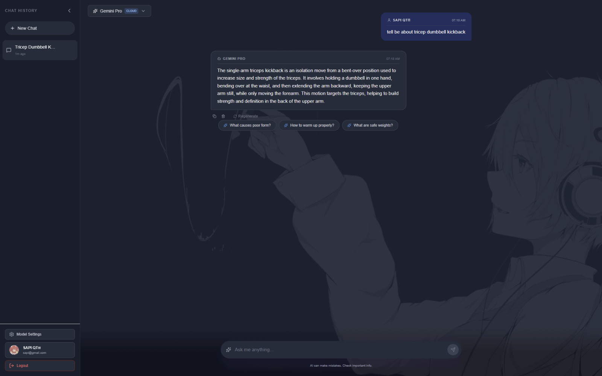

# AIUI - FitBuddy Chatbot

AIUI is a Next.js fitness chatbot that combines cloud and local model options with session history, profile controls, and a polished chat UI.

## Preview



## Features
- **FitBuddy Persona**: A fitness-focused assistant for everyday questions and guidance.
- **Model Switching**: Move between Llama 3, Gemini, Gemini Pro, and local Ollama models when available.
- **Session Memory**: Keeps chat history for signed-in users and guest sessions.
- **User Tools**: Includes login, profile editing, background customization, tags, and follow-up suggestions.
- **Modern Stack**: Next.js App Router, TypeScript, Tailwind CSS, Prisma, Groq SDK, and Google Generative AI SDK.

## Getting Started

### 1. Clone the Repository
```bash
git clone https://github.com/SapiOwO/AIUI.git
cd AIUI
```

### 2. Install Dependencies
Make sure you have Node.js installed.
```bash
npm install
```

### 3. Set Up Environment Variables
Create a file named `.env.local` in the root directory and add your API keys.

```env
GROQ_API_KEY=your_groq_key_here
GEMINI_API_KEY=your_gemini_key_here
```

### 4. Run the Development Server
```bash
npm run dev
```

Open [http://localhost:3000](http://localhost:3000) in your browser to see the app.

### 5. Optional Checks
```bash
npm run lint
npm run build
```
